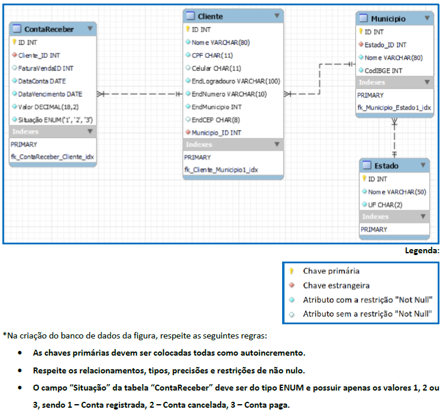

# Trabalho de banco de dados da faculdade

## Etapa 1 🆗
    Criar uma base de dados chmada "Loja" com MySQL Server por meio do 
    software MySQL Workbench. 
    Adicione as estruturas de dados neste banco, utilizando os comandos 
    de definição de dados (DDL) da linguagem SQL,
    e respeitando o modelo definido no DER da figura a seguir.

## DER (Diagrama entidade relacionamento)



##

[RESULTADO DA PRIMEIRA ETAPA](script.sql)


```sql	
    CREATE SCHEMA IF NOT EXISTS `Loja` DEFAULT CHARACTER SET utf8mb4;

USE `Loja`;

-----------------------------
-- Table `loja`.`Estado`
-----------------------------

create table if not exists `Loja`.`Estado`(
    `ID` int not null auto_increment,
    `Nome` varchar(50) not null,
    `UF` char(2) not null,
    primary key(`ID`)
)engine = InnoDB;

-----------------------------
-- Table `loja`.`Municipio`
-----------------------------

create table if not exists `Loja`.`Municipio`(
	`ID` int not null auto_increment,
    `Nome` varchar(80) not null,
    `CodIBGE` int not null,
    `Estado_ID` int not null,
    primary key(`ID`),
    index `fk_Municipio_Estado1_idx` (`Estado_ID` ASC),
    constraint `fk_Municipio_Estado1`
		foreign key(`Estado_ID`)
        references `Loja`.`Estado`(`ID`)
        on delete no action
        on update no action
)engine = InnoDB;

-----------------------------
-- Table `loja`.`Cliente`
-----------------------------

create table if not exists `Loja`.`Cliente`(
	`ID` int not null auto_increment,
	`Nome` varchar(80) not null,
    `CPF` char(11) not null,
    `Celular` char(11) null,
    `EndLogradouro` varchar(100) not null,
    `EndNumero` varchar(10) not null,
    `EndMunicipio` int not null,
    `EndCEP` char(8) null,
    `Municipio_ID` int not null,
    primary key(`ID`),
    index `fk_Cliente_Municipio1_idx` (`Municipio_ID` ASC),
    constraint `fk_Cliente_Municipio1`
		foreign key(`Municipio_ID`)
        references `Loja`.`Municipio`(`ID`)
        on delete no action
        on update no action
)engine = InnoDB;
-----------------------------
-- Table `loja`.`ContaReceber`
-----------------------------

create table if not exists `Loja`.`ContaReceber`(
	`ID` int not null auto_increment,
    `FaturaVendaID` int null,
    `DataConta` date not null,
    `DataVencimento` date not null,
    `Valor` decimal(18,2) not null,
    `Situacao` ENUM('1','2','3') not null,
    `Cliente_ID` int not null,
    primary key(`ID`),
    index `fk_ContaReceber_Cliente1_idx` (`Cliente_ID` ASC),
    constraint `fk_ContaReceber_Cliente1`
		foreign key(`Cliente_ID`)
        references `Loja`.`Cliente`(`ID`)
        on delete no action
        on update no action
)engine = InnoDB
comment = '				';

```
## Etapa 2 🆗
    Crie um script chamado “inserir.sql” 
    contento os comandos de manipulação (DML), 
    com o objetivo de popular todas as tabelas existentes 
    na base de dados (ou seja, inserir dados nas tabelas!). 
    Insira ao menos três registros por tabela.

[RESULTADO DA SEGUNDA ETAPA](inserir.sql)

```sql
/* INSERINDO NA TABELA ESTADO */
insert into estado(Nome, UF) values ("Bahia", "BA");
insert into estado(Nome, UF) values ("Paraíba", "PB");
insert into estado(Nome, UF) values ("Minas Gerais", "MG");

/* INSERINDO NA TABELA Municipio */
insert into municipio(Nome, CodIBGE, Estado_ID) values ("João Pessoa", 2507507, 2);
insert into municipio(Nome, CodIBGE, Estado_ID) values ("Feira de Santana", 2910800, 1);
insert into municipio(Nome, CodIBGE, Estado_ID) values ("Uberlândia", 3170206, 3);

/* INSERINDO NA TABELA Cliente */
insert into cliente(Nome, CPF, Celular, EndLogradouro, EndNumero, EndMunicipio, EndCEP, Municipio_ID) 
values("Claudia Dantas Melo",'58437915846','83987456124',"Rua Pastor Misael Jacomé Cavalcanti",
"157",7507,'58075010',1);
insert into cliente(Nome, CPF, Celular, EndLogradouro, EndNumero, EndMunicipio, EndCEP, Municipio_ID) 
values("Josias Antonio Holanda da Cruz",'87124956830','31996888845',"Rua Belkina Carvalho Cunha",
"58",70206,'38411342',3);
insert into cliente(Nome, CPF, Celular, EndLogradouro, EndNumero, EndMunicipio, EndCEP, Municipio_ID) 
values("Fhelipa de Luna",'15397546854','71986457325',"Rua São Vicente","10",10800,'44077320',2);

/* INSERINDO NA TABELA ContaReceber */
insert into contareceber(FaturaVendaID, DataConta, DataVencimento, Valor, Situacao, Cliente_ID) 
values (1,'2023-05-10','2023-05-15',1500,'1',3);
insert into contareceber(FaturaVendaID, DataConta, DataVencimento, Valor, Situacao, Cliente_ID) 
values (2,'2023-06-05','2023-06-15',2000,'3',1);
insert into contareceber(FaturaVendaID, DataConta, DataVencimento, Valor, Situacao, Cliente_ID) 
values (3,'2023-07-25','2023-07-05',100,'2',2);
```

## Etapa 3 🆗
    Por meio dos comandos de consulta (DQL) da linguagem SQL, 
    elabore um script chamado “consulta.sql” que irá conter uma 
    visão (VIEW) que retornará todas as contas que ainda não foram 
    pagas (Situação = 1), devendo conter as seguintes informações:
    • ID da conta a receber
    • Nome e CPF do Cliente associado à conta
    • Data de vencimento da conta
    • Valor da conta

[RESULTADO DA TERCEIRA ETAPA](consulta.sql)

```sql
create view contasNaopagas AS
select CR.ID, C.Nome, C.CPF, CR.DataVencimento, CR.Valor
from contareceber as CR
inner join cliente as C
on CR.Cliente_ID = C.ID
where CR.Situacao = 1;

select * from contasNaopagas;
```